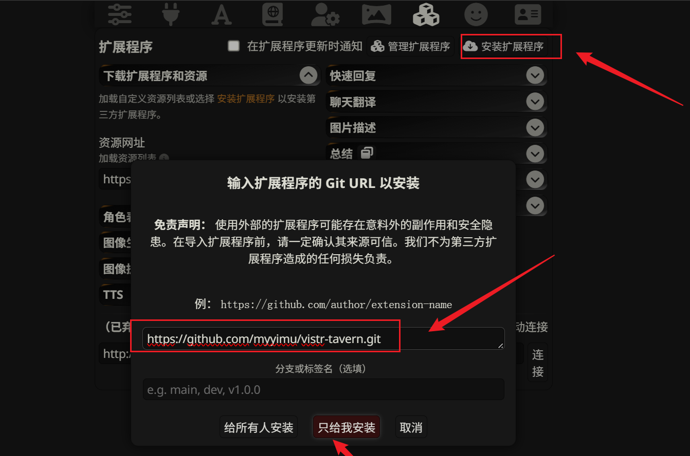

# 使用手册

本文说明如何安装并测试 VistrTavern `v0.6.1-alpha`。

VistrTavern 目前仍是实验性 MVP。当前目标是跑通一个本地闭环：

```text
安装扩展
-> 打开 SillyTavern 聊天
-> 接管一个角色
-> 记录真人异常发言
-> 控制权回到 AI
-> 注入 continuity handoff
-> 导出结构化素材
```

## 环境要求

- 本地 SillyTavern。
- 至少一个可聊天角色。
- 本仓库放在 SillyTavern 用户扩展目录下。

推荐路径是使用 SillyTavern 的 GitHub 扩展安装功能。手动文件夹安装和 release zip 安装仍然作为本地测试 fallback 保留。

## GitHub 安装

1. 打开 SillyTavern 的扩展面板。
2. 点击 `安装扩展程序`。
3. 在 Git URL 输入框粘贴 `https://github.com/myyimu/vistr-tavern.git`。
4. 分支或标签名可以留空，除非你需要指定某个 release tag。
5. 点击 `只给我安装`。
6. 重启 SillyTavern 或刷新浏览器界面。
7. 打开一个聊天，确认页面上出现浮动的 `VT` 按钮。



## 手动文件夹安装

1. 克隆或下载这个仓库。
2. 如果需要，把目录名改成 `vistr-tavern`。
3. 把目录放到 SillyTavern 的用户扩展目录下。
4. 重启 SillyTavern 或刷新浏览器界面。
5. 打开一个聊天，确认页面上出现浮动的 `VT` 按钮。

预期目录结构：

```text
SillyTavern/
  data/
    default-user/
      extensions/
        vistr-tavern/
          manifest.json
          index.js
          style.css
          core/
          data/
          ui/
```

如果扩展没有出现，检查浏览器控制台和 SillyTavern 服务端日志。

## 基本流程

### 1. 打开面板

打开任意 SillyTavern 聊天，点击浮动的 `VT` 按钮。

面板会优先显示最短可用路径：

- 角色选择器
- 接管引导
- 接管控制
- SillyTavern 原聊天框发送路由
- 灵感捕获
- 创作者随手笔记

其他内容会收进 `可选设定`、`创作者工具` 和 `Debug`。第一次使用时可以先全部忽略。

面板顶部的 `语言` 选择器可以在中文和 English 之间切换。选择会通过浏览器 `localStorage` 保存在本地，同一浏览器配置下刷新后仍会保持。

### 2. 选择角色

选择一个要被真人临时接管的角色。

角色列表来自当前 SillyTavern 上下文。如果列表为空，刷新聊天，或确认当前 SillyTavern 版本是否向扩展暴露角色数据。

选择后，VistrTavern 会显示一条接管引导。开始前，它会明确提示“当前选择的是谁”；接管进行中，它会变成步骤提示：

- 在 SillyTavern 正常聊天框里，以这个角色写一句话或一个动作。
- 按原来的发送按钮；VistrTavern 会让它显示成这个角色说的话。
- 让其他 AI 角色回应。
- 客串结束后点击 `结束`。
- 恢复后点击 `捕获灵感`，把这次异常整理成创作素材。

### 3. 可选：选择场景类型

如果需要，可以打开 `可选设定`，选择三种场景类型之一：

- `网文剧本`：偏冲突升级、反转点、人物关系裂痕和后续章节钩子。
- `AI 剧本杀`：偏线索污染、证词矛盾、身份误导和可疑动机。
- `虚拟剧场`：偏表演失控、角色自我察觉、世界真实性和舞台规则裂缝。

场景类型会影响 Creator Pack 和整理素材的输出重点。它不会修改 SillyTavern 的模型设置。

### 4. 可选：填写创作上下文

打开 `可选设定` -> `创作上下文`，保存用于导出和素材整理的本地备注：

- `故事前提`：规则、类型或设定。
- `当前局面`：客串前已经存在什么压力或未解决冲突。
- `可客串角色`：哪些角色或角色类型可以被短暂客串。
- `AI 连续性备注`：AI 应该保留什么，比如连续性、NPC 反应和后果。

这是本地创作者元数据。它不会创建共享多人会话。

### 5. 可选：设置场景和张力

填写：

- `Scene`：简短场景名，例如 `Royal Banquet`。
- `Mood`：场景氛围，例如 `oppressive`。
- `Tension`：0 到 100。

点击 `Save Scene`。

这些字段会保存到叙事记忆里，并附着到后续消息上。

### 6. 可选：选择接管选项

开始接管前，选择：

- `Duration min`：真人控制持续多久。
- `Anonymous`：这次接管在世界内是否隐藏。
- `Director`：是否作为明确作者引导，而不是匿名入侵。
- `Awareness after recovery`：AI 恢复后如何理解刚才的异常。

Awareness 模式：

- `AI 无感`：角色不表现异常意识。
- `断片`：角色可以感到迟疑、记忆断片或失控感。
- `怀疑`：角色可以怀疑外部意志、世界规则或真实性不稳定。

Awareness target：

- `Controlled character`：只有恢复控制的角色表现异常意识。
- `Observers`：旁观 AI 角色可以察觉这个角色不太对劲。
- `Both`：恢复控制的角色和旁观者都可以同步表现异常意识。

普通沉浸测试建议使用 `Anonymous` + `AI 无感` + `Controlled character`。

### 7. 可选：填写真人意图

开始接管前，可以打开 `可选设定` -> `真人意图` 记录这次客串为什么存在。可以先点快捷按钮，再按需要微调自动填入的字段。

适合填写：

- 真人想制造什么？
- 想让谁感到压力？
- 想破坏什么关系或规则？
- 想泄露什么秘密或不可能知道的信息？

真人意图会作为创作者素材保存，并进入导出。它不会伪造成 AI 消息。

### 8. 开始接管

点击 `开始接管`。

VistrTavern 会把选中的角色标记为真人控制状态。在这个窗口内，你仍然使用 SillyTavern 原聊天框输入；发送时，VistrTavern 会把这句话作为该角色消息插入当前聊天，同时记录为真人接管造成的异常发言。

面板会显示 `正在接管 {角色}` 和接下来的操作步骤。如果发现选错了角色，可以点击 `结束` 后重新选择并开始接管。

### 9. 发送接管发言

直接在 SillyTavern 原聊天框里输入真正的客串台词，然后按发送。

VistrTavern 会拦截这次普通发送，并优先通过 SillyTavern 扩展 API 调用内置 `/sendas` 命令。如果该 API 不可用，则 fallback 到 SillyTavern 暴露的 chat 渲染接口直接插入消息。

如果当前 SillyTavern 版本的原生输入框识别失败，再打开 `Fallback：面板发送`，在面板里输入并点击 `发送为角色并记录`。

第一次使用时，可以不用打开 fallback 里的 `可选：乱入标记`。VistrTavern 会默认使用 `角色接管`。

只有当你希望这句话在导出和 handoff 中带上明确叙事作用时，再打开它：

- `角色接管`：普通的真人接管角色发言。
- `记忆断片`：后续可以被角色理解为失控、迟疑或断片。
- `剧情钩子`：目的是打开下一步后果或转折。
- `关系破坏`：目的是破坏、压迫或试探一段关系。
- `线索污染`：改变证词、证据、动机或推理链。

示例：

```text
Do you really believe the king is still alive?
```

系统会记录一条结构化消息，包含：

- controller: `human`
- visibility
- scene
- intrusion id
- tension

同时会创建一个扰动事件。SillyTavern 里可见的消息会表现为角色消息，而不是用户消息。`仅记录` 已收进 fallback 区域；只有在 SillyTavern 发送失败，或你明确只想保存 VT 私有记忆而不写入当前聊天时，才使用它。

发送接管发言后，VistrTavern 会为下一次生成创建一个临时反应锚点。这个锚点会要求下一条 AI 回复先回应刚插入的角色发言，再继续之前的话题。

Prompt 注入会跟随当前 UI 语言。面板使用中文时，反应锚点和 continuity handoff 会生成中文提示；切换到 English 时则生成英文提示。

### 10. 让 AI 反应

继续 SillyTavern 聊天，让 AI 角色回应。

在 intrusion 激活窗口内，VistrTavern 会尝试捕获 AI 回复，并把它们绑定到当前 intrusion。

这一部分依赖 SillyTavern runtime events，需要在你的本地环境验证。

### 11. 结束接管

intrusion 有两种结束方式：

- 点击 `End`
- 等待倒计时结束

结束后，VistrTavern 会把角色恢复为 AI 控制，并生成 continuity handoff。

### 12. 继续聊天

下一次生成时，VistrTavern 会尝试通过 SillyTavern 的 `generate_interceptor` 注入 pending continuity handoff。

handoff 会告诉 AI：

- 真人控制期间发生的事已经是剧情事实
- 不要忽略或改写这些事件
- 继续承接情绪、关系和世界状态后果
- 遵守选定的 awareness 模式
- 如果 awareness 是 `断片` 或 `怀疑`，下一条相关 AI 回复应包含一段简短斜体内心独白

收到下一条 AI 回复后，这个 handoff 应该被标记为 consumed。

内心独白示例：

```text
*Why did I say that? That did not feel like me.*
*That sentence came from my mouth, but it did not feel born from my own will. Is this world truly stable?*
```

## Debug 面板

`Debug` 区域用于 alpha 测试。

它会显示：

- `Version`：扩展版本。
- `Storage`：当前持久化模式，通常是 `chatMetadata` 或 `localStorage`。
- `Compatibility`：SillyTavern context、角色数据、聊天数据、事件和 prompt interceptor 的快速兼容性快照。
- `Active intrusion`：当前被真人控制的角色。
- `Pending handoff`：最新未消费 handoff。
- `Last injected`：最近一次通过 generation interceptor 注入的 handoff。
- `Last consumed`：最近一次被 AI 回复消费的 handoff。
- `Last AI message`：VistrTavern 最近捕获到的 AI 消息。
- `Interceptor`：最近一次 generation interceptor 结果。
- `Last error`：VistrTavern 记录到的最近运行时错误。

如果存在 pending handoff，但 prompt interceptor 还没有被调用，Debug 面板会显示明显提示。此时可以触发下一条 AI 回复来调用 interceptor；如果自动注入仍不明确，就使用 `Copy Latest Handoff`。

用这个面板确认 handoff 流程是否正常：

```text
pending
-> injected
-> consumed
```

如果需要在浏览器控制台检查，debug snapshot 也会发布到扩展根节点：

```js
JSON.parse(document.getElementById('vistr-tavern-root').dataset.vtDebugState)
```

也可以点击 `Copy Debug Snapshot`，把复制出的 JSON 粘贴到 alpha feedback 或 bug report 里。提交前请先检查并移除私密 RP 内容。

## 手动 Handoff Fallback

如果自动 prompt 注入在当前 SillyTavern 版本里不工作，点击 `Copy Latest Handoff`。

把复制出来的 handoff 粘贴到合适的临时上下文或 prompt 区域，再触发下一次 AI 生成。这只是 alpha 测试阶段的 fallback；默认路径仍然是通过 `generate_interceptor` 自动注入。

## 剧情分支标记

当一次 intrusion 打开了值得继续发展的路线时，使用 `Branch Point`。

1. 选择相关角色。
2. 输入分支标题。
3. 选择分支类型，例如 `Identity reveal`、`Conspiracy` 或 `Clue contamination`。
4. 写一段简短分支说明。
5. 可选填写最多三条后续路线。
6. 点击 `Mark Branch Point`。

剧情分支会保存到本地 memory，并出现在 JSON、Markdown 和 Creator Pack 导出中。它不会创建聊天消息。

面板中的已保存剧情分支列表目前是只读的，用来确认哪些路线已经标记，方便导出前检查。

## 素材工作台

当你想把当前 memory 快速整理成创作者可用摘要时，点击 `整理素材`。

它会整理：

- 真人异常发言
- AI 反应
- 冲突钩子
- 人设 / 关系漂移
- 剧情分支路线
- 异常察觉素材
- 基于当前场景类型的下一步可写方向

点击 `复制素材` 可以复制到剪贴板，点击 `导出整理素材` 可以下载 Markdown。

## 互动灵感捕获

intrusion 结束后，点击 `捕获灵感`。

VistrTavern 会整理：

- 这次客串为什么比普通 AI 群像输出更不按套路
- 它制造了什么对抗感
- 哪个关系裂缝或分支路线被打开
- 三个可继续写的方向

这个功能服务的是那种时刻：真人短暂进入角色后，角色突然像一个真正独立意志，而不是同一个模型节奏里的另一种声线。

## 创作者脑暴空间

`创作者脑暴空间` 用来保存不会进入 SillyTavern 聊天的私有笔记。

笔记类型：

- `灵感火花`
- `角色人格变化`
- `冲突升级`
- `可写片段`
- `下次客串`

脑暴笔记会进入导出和 Creator Pack。

## 导出

点击：

- `Export Markdown`：导出创作者可读的故事素材。
- `Export Creator Pack`：导出浓缩创作包，包含异常发言、AI 反应、冲突钩子、分支路线、异常察觉和 handoff 上下文。
- 素材工作台里的 `导出整理素材`：导出按当前场景类型整理过的创作者摘要。
- `Export Character Prompt`：导出可复制给外部模型的人设提取 prompt。
- `Export JSON`：导出完整结构化记忆。

Markdown 导出包含：

- 当前场景
- 创作上下文
- 入侵时间线
- 真人意图
- 真人异常发言
- AI 反应
- AI 接管连续性 handoff
- AI 异常察觉事件
- 互动灵感捕获
- 创作者脑暴笔记
- 剧情分支标记
- 高张力对话
- 扰动事件
- 人物关系变化
- 世界状态变化

## Alpha 测试要点

对 `v0.6.1-alpha` 来说，一次成功测试应该满足：

- 页面出现 `VT` 按钮
- 角色能加载到选择器里
- intrusion 可以开始和结束
- 真人异常发言能被记录
- AI 恢复后会生成 handoff
- pending handoff 数量会变化
- 下一条 AI 回复会承接被真人改变过的剧情
- Markdown 和 JSON 导出包含记录内容
- Creator Pack 和 Character Prompt 能成功导出
- 面板可以在中文和英文之间切换
- 场景类型选择可以保存，并影响整理素材
- 面板中可以看到已保存剧情分支
- 创作上下文备注可以保存
- 真人意图进入 handoff 和导出素材
- 互动灵感捕获和脑暴笔记会出现在导出里

## 故障排查

### GitHub 安装失败

如果仓库是私有的，或 GitHub 访问失败，SillyTavern 可能无法拉取。可以使用手动文件夹安装或 release zip 安装作为 fallback。

### 看不到 `VT` 按钮

检查：

- 目录名是否为 `vistr-tavern`
- `manifest.json` 是否在扩展目录根部
- 是否重启或刷新了 SillyTavern
- 浏览器控制台是否有 import 错误

### 角色列表为空

刷新聊天。如果仍然为空，可能是当前 SillyTavern 版本暴露角色数据的方式不同。

### AI 回复没有出现在导出里

AI 反应捕获依赖 SillyTavern runtime events。特定版本可能需要做兼容修正。

### 生成了 handoff，但 AI 没有承接

观察生成后 pending handoff 数量是否变化。如果没有变化，可能是 generation interceptor 没有运行，或没有按预期插入 handoff。

### handoff 污染聊天历史

这是 alpha 阶段需要重点验证的问题。当前实现会把带标记的 system-style message 插入生成上下文，但仍需要真实 SillyTavern 环境确认它不会写脏实际聊天记录。

## 隐私说明

VistrTavern 会通过 SillyTavern chat metadata 或浏览器 localStorage fallback 在本地记录聊天衍生的故事素材。

导出文件可能包含角色名、场景备注、对话和剧情事件。如果内容包含私人 RP，请不要直接公开导出文件。
